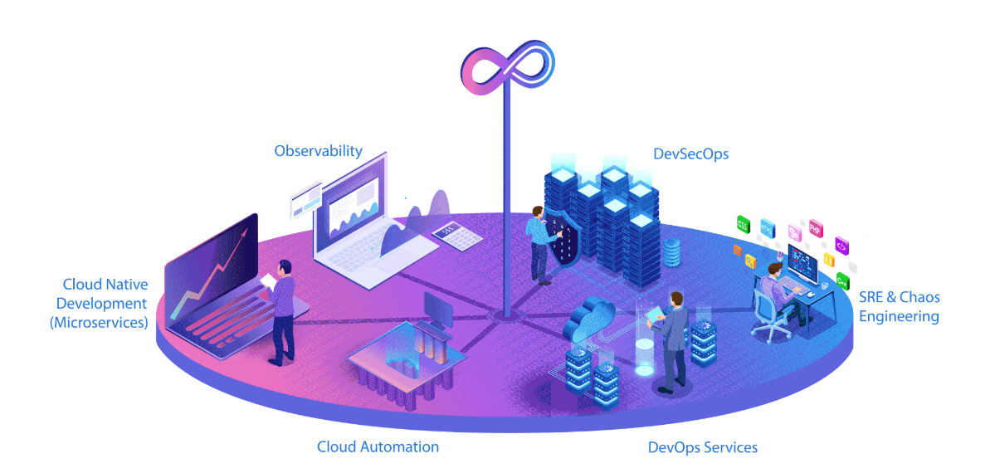

<!-- HERO BANNER - GitHub Compatible -->
<picture>
  <source media="(prefers-color-scheme: dark)" srcset="https://readme-typing-svg.demolab.com?font=Fira+Code&weight=600&size=24&duration=3000&pause=500&color=38BDF8&center=true&vCenter=true&width=800&lines=DevOps+%26+Cloud+Infrastructure+Engineer;Infrastructure+as+Code+Advocate;Container+Orchestration+Expert;DevSecOps+Practitioner;SRE+Fundamentals">
  
</picture>

<!-- HERO BANNER -->

### *"Building Resilient Infrastructure, One Pipeline at a Time."*

> Automate everything. Secure by default. Observe obsessively.

---

## 👋 About Me

**Name:** Ritej Anil Mule  
**Role:** DevOps & Cloud Infrastructure Engineer  
**Location:** India  

**Focus:**  
- Cloud-Native Automation (AWS)  
- Infrastructure as Code (Terraform)  
- Container Orchestration (Kubernetes / EKS)  
- CI/CD Pipeline Engineering  
- Security-First DevOps (DevSecOps)  
- GitOps (ArgoCD)  

**Mantra:** *"If it's not automated, it's technical debt."*  
**Currently Learning:** [GitOps, ArgoCD, Observability at Scale]

I'm a **detail-oriented DevOps engineer** with deep hands-on experience across the full infrastructure lifecycle — from writing modular Terraform to shipping containers on production EKS clusters. I care about **99.9% reliability**, reducing MTTD/MTTR, and treating infrastructure as living, versioned software.

My work is driven by three principles: **automate aggressively**, **secure by default**, and **observe everything**.

---

## 📜 Certifications

| Certification | Issuer | Status |
|---------------|--------|--------|
|  | Amazon Web Services (via Infosys Springboard) | ✅ Active |
|  | Oracle University | ✅ Active |
|  | Amazon Web Services | ✅ Active |

<b>📌 Certification Details & Credentials</b>

 

**AWS Certified Developer – Associate**  
- *Issued by:* Amazon Web Services (Infosys Springboard)  
- *Skills Validated:* AWS service development, deployment, debugging, security, and serverless applications  
- *Key Topics:* IAM, EC2, Lambda, API Gateway, DynamoDB, S3, CloudFormation

**Oracle Cloud Infrastructure 2025 Certified DevOps Professional**  
- *Issued by:* Oracle University  
- *Skills Validated:* OCI DevOps services, CI/CD pipelines, Infrastructure as Code (Resource Manager), monitoring, and logging  
- *Key Topics:* OCI DevOps, Terraform on OCI, Artifact Registry, Logging Analytics

**AWS Cloud Quest Cloud Practitioner**  
- *Issued by:* Amazon Web Services  
- *Skills Validated:* AWS Cloud fundamentals, core services, pricing, security, and compliance  
- *Key Topics:* EC2, S3, VPC, IAM, RDS, CloudWatch, Shared Responsibility Model

---

## 🛠️ Tech Stack & Tools

### ☁️ Cloud & Infrastructure

### 🏗️ Infrastructure as Code

### 🔁 CI/CD & Automation

### ⚙️ Container Orchestration

### 🔒 DevSecOps

### 📊 Monitoring & Observability

### 💻 Languages & Scripting

---

## 🚀 Featured DevOps Projects

<table>
  <tr>
    <td width="50%" valign="top">

### 🎯 End-to-End K8s Three-Tier Project
**[→ View Repository](https://github.com/ritejmule2126/End-to-End-Kubernetes-Three-Tier-DevSecOps-Project)**

**Complete production-grade Three-Tier App (React + Node + MongoDB) on AWS EKS**

- 🏗️ **Infrastructure:** Terraform for Jenkins Server + EKS cluster
- 🔄 **CI/CD:** Jenkins pipelines for backend, frontend, and infrastructure
- 🚢 **GitOps:** ArgoCD for declarative Kubernetes deployments
- 📊 **Monitoring:** Prometheus + Grafana for real-time observability
- 🔒 **Code Quality:** SonarQube integration with quality gates
- 🌐 **Ingress:** Load balancer with external traffic routing

</td>
    <td width="50%" valign="top">

### 🔐 DevSecOps CI Pipeline
**[→ View Repository](https://github.com/ritejmule2126/DevSecOps-CI-Pipeline-GitHub-Actions-Project)**

**6-stage automated DevSecOps pipeline on self-hosted AWS EC2 runner**

- ✅ **98.5% pipeline success rate** | 3-4 min average build time
- 🔒 SAST (SonarCloud) + SCA (Snyk) on every commit
- 📦 JFrog Artifactory for versioned artifact storage
- 🐳 Automated Docker builds with SHA-based tagging
- 🔐 All credentials secured via GitHub Secrets
- 📋 Reusable workflow files for maintainability

</td>
  </tr>
  <tr>
    <td width="50%" valign="top">

### 🏗️ EKS Terraform Infrastructure
**[→ View Repository](https://github.com/ritejmule2126/EKS-Terraform-Infra)**

**Production-Ready EKS Cluster with Terraform + GitHub Actions Automation**

- 🏗️ **Modular IaC:** Reusable Terraform modules for EKS, VPC, Node Groups
- 🔄 **CI/CD Automation:** GitHub Actions for automated infrastructure deployment
- 🌐 **Networking:** Custom VPC with public/private subnets across multiple AZs
- 🔒 **Security:** IAM roles, Security Groups, and least-privilege access
- 📦 **Scalability:** Auto-scaling node groups with spot/fleet instance support
- ☁️ **Remote State:** S3 backend with DynamoDB state locking

</td>
    <td width="50%" valign="top">

### 🐳 Docker AWS DevOps Capstone
**[→ View Repository](https://github.com/ritejmule2126/docker-aws-devops-capstone-project)**

**Full-Stack Application (React + Node + MySQL) Containerized & Deployed on AWS**

- 🐳 **Multi-Container Setup:** Docker Compose for frontend, backend, database
- ☁️ **Cloud Deployment:** AWS EC2 with proper security group configuration
- 🔄 **Service Orchestration:** Internal bridge network for inter-service communication
- 💾 **Data Persistence:** Docker volumes for MySQL database storage
- 🩺 **Health Checks:** Custom /health endpoint with Docker monitoring
- 📊 **Logging:** Centralized Docker logs for debugging and monitoring

</td>
  </tr>
</table>

---

## 📊 Project Impact & Metrics

| Project | Key Achievement | Tech Highlight |
|---------|----------------|----------------|
| **K8s Three-Tier** | Full GitOps workflow with ArgoCD | Prometheus + Grafana monitoring |
| **DevSecOps Pipeline** | 98.5% success rate, 8 vulns caught/build | Self-hosted GitHub runner |
| **EKS Terraform** | Modular, reusable infrastructure | S3 remote state + DynamoDB lock |
| **Docker Capstone** | 4-container app on AWS EC2 | Health checks + persistent volumes |

---

## 📜 My DevOps Journey — 15-Week Chronicle

> *"I don't just use DevOps tools — I documented every step of learning them."*

Over **15 structured weeks**, I progressed from Linux fundamentals to production-grade Kubernetes monitoring. This isn't a tutorial list — it's a **living record of deliberate, progressive learning**.

| Week | Topic | Milestone |
|------|-------|-----------|
| 1–2 | Linux & Shell Scripting | Automated sys-admin tasks with Bash |
| 3–4 | Git & Version Control | Branching strategies, hooks, workflows |
| 5–6 | Docker & Containerization | Multi-stage builds, Docker Compose |
| 7–8 | CI/CD with Jenkins & GitHub Actions | Pipeline-as-Code from scratch |
| 9–10 | AWS Core (EC2, S3, IAM, VPC) | Deployed real workloads on AWS |
| 11–12 | Terraform & IaC | Modular infra, remote state, workspaces |
| 13–14 | Kubernetes & EKS | Deployments, Services, Ingress, HPA |
| 15 | Prometheus & Grafana | Full observability stack on K8s |

**[→ Read the Full DevOps Journey](https://ritejportfolio.kesug.com/pages/devops-journey.html))**

---

## 📈 GitHub Stats

> 📌 **Note:** All repositories above are actively maintained DevOps projects demonstrating real-world infrastructure automation, CI/CD pipelines, and cloud-native practices.

---

## 📫 Let's Connect

If you're building cloud infrastructure, scaling microservices, or need a DevOps engineer who treats automation as a craft — let's talk.

---

*"Infrastructure is code. Code is craft. Craft is everything."*

